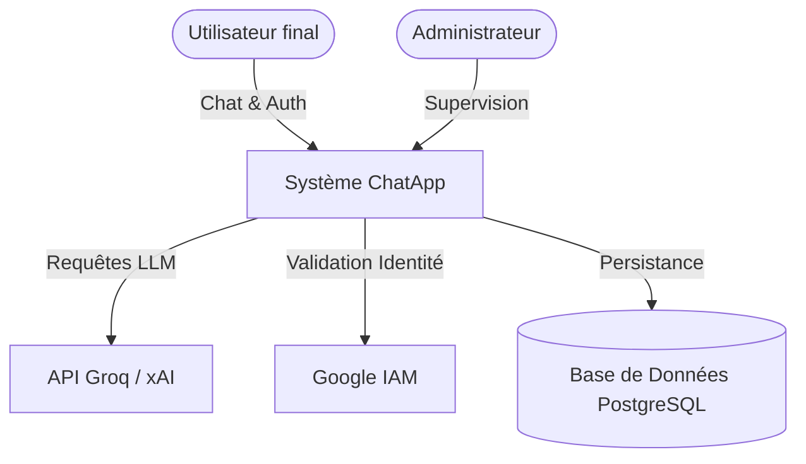
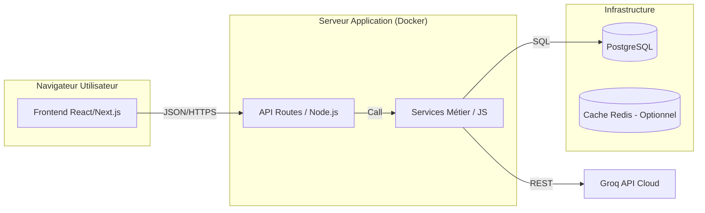
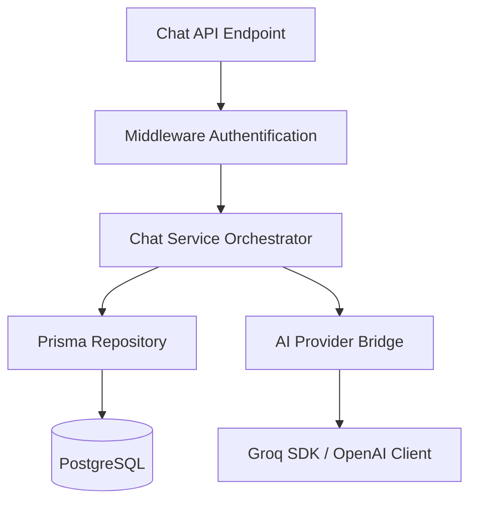

# 01. Rapport de Conception de la Solution et Architecture Informatique (C1.3)

---

## 1. Introduction Globale et Vision

L'application **ChatApp Web IA** est une réponse technologique aux défis croissants posés par l'adoption massive des modèles de langage (LLM) en entreprise et dans le domaine de l'éducation. Ce document détaille la phase de conception fonctionnelle et les choix d'architecture informatique qui sous-tendent la robustesse et la scalabilité de la solution.

### 1.1 Contexte du Marché
En 2026, l'interaction homme-machine ne se limite plus à des interfaces statiques. Le concept de "Conversational User Interface" (CUI) est devenu le standard. ChatApp s'inscrit dans cette mouvance en proposant une interface centralisée, agnostique du modèle sous-jacent, permettant une productivité accrue tant pour les tâches administratives que créatives.

### 1.2 Objectif du Document
Démontrer que l'architecture proposée ne répond pas seulement à un besoin immédiat de chat, mais constitue une plateforme évolutive capable de supporter des charges de travail complexes et de garantir une sécurité "Enterprise-Grade".

---

## 2. Analyse des Besoins et Cibles

### 2.1 Les Personas (User Profiling)

Pour orienter la conception, trois personas principaux ont été identifiés :

1.  **Victor (Étudiant en Développement)** :
    *   *Usage* : Utilise ChatApp pour débugger du code et générer des templates de CV.
    *   *Besoin* : Rapidité de réponse (faible latence) et persistance fiable de ses historiques.
2.  **Cécile (Formatrice RH)** :
    *   *Usage* : Supervise l'usage de l'IA par les étudiants et génère des rapports de synthèse.
    *   *Besoin* : Sécurité des données et authentification forte (OAuth Google).
3.  **L'Administrateur SI** :
    *   *Usage* : Gère les quotas d'API et surveille la charge système.
    *   *Besoin* : Supervision, logs structurés et déploiement facile (Docker).

### 2.2 Besoins Fonctionnels Détaillés (RF)

| ID | Catégorie | Description | Priorité |
|----|-----------|-------------|----------|
| RF-001 | Auth | Connexion sécurisée via providers tiers (Social Login). | P1 |
| RF-002 | Chat | Support du streaming pour un affichage fluide de la réponse IA. | P1 |
| RF-003 | Hist | Recherche textuelle dans l'historique des conversations. | P2 |
| RF-004 | AI | Paramétrage dynamique du "System Prompt" par conversation. | P2 |
| RF-005 | CV | Module spécifique de génération de documents structurés (MarkDown -> PDF). | P1 |

### 2.3 Besoins Non-Fonctionnels (RNF)

*   **RNF-001 : Disponibilité** : Taux de disponibilité cible de 99.9% (HA).
*   **RNF-002 : Latence** : Réception du premier token IA en moins de 200ms.
*   **RNF-003 : Portabilité** : Indépendance totale vis-à-vis du fournisseur cloud (Agnoticisme Cloud).

---

## 3. Analyse Stratégique (SWOT)

Avant la conception technique, une analyse SWOT (Forces, Faiblesses, Opportunités, Menaces) a été réalisée pour valider la viabilité de la solution.

| Points | Interne | Externe |
|--------|---------|---------|
| **Positif** | **Forces (Strengths)** : Architecture moderne (Next.js), Temps réel, Coût d'infrastructure faible. | **Opportunités (Opportunities)** : Croissance du RAG, Marché de l'IA générative en pleine explosion. |
| **Négatif** | **Faiblesses (Weaknesses)** : Dépendance à l'API Groq, Pas de mode hors-ligne. | **Menaces (Threats)** : Évolution des régulations (RGPD/AI Act), Changement de tarification LLM. |

---

## 4. Architecture Informatique : Le Modèle C4

Pour assurer une communication claire entre les parties prenantes, nous utilisons le standard C4 (*Context, Containers, Components, Code*).

### 4.1 Niveau 1 : Diagramme de Contexte (System Context)

Ce diagramme montre le système ChatApp dans son environnement global.

### 4.2 Niveau 2 : Diagramme de Conteneurs (Container Diagram)

Détail des briques logicielles communicantes.

### 4.3 Niveau 3 : Diagramme de Composants (Component Diagram)

Zoom sur le conteneur "Serveur Application".

---

## 5. Choix Techniques et Justifications Approfondies

### 5.1 Pourquoi Next.js vs SPA Simple (React/Vite) ?
L'usage de Next.js permet de bénéficier de **Server Side Rendering (SSR)**. Pour une application de chat, cela permet de pré-calculer la session utilisateur côté serveur, réduisant ainsi le temps de chargement initial et améliorant la sécurité en masquant les variables d'environnement critiques au frontend.

### 5.2 Le choix de PostgreSQL vs NoSQL (MongoDB)
Bien que le chat semble se prêter au NoSQL par sa structure de document (JSON), PostgreSQL a été retenu pour sa **gestion transactionnelle (ACID)** supérieure. La relation entre les `Users`, les `Conversations` et les `Messages` est strictement définie. Prisma ORM permet de manipuler ces schémas avec la souplesse du JS tout en gardant la rigueur du SQL.

---

## 6. Sécurité "By Design" et Conformité

La sécurité n'est pas une couche ajoutée à la fin, mais un socle de la conception.

### 6.1 Les 5 Piliers de Sécurité ChatApp
1.  **Défense en Profondeur** : Authentification au niveau de la gateway API et vérification des tokens JWT à chaque appel de service.
2.  **Principe du Moindre Privilège** : Le client Prisma n'utilise qu'un utilisateur DB restreint aux schémas `app`.
3.  **Sanitization Automatique** : Utilisation de librairies de validation (Zod/Joi) pour éviter les injections de scripts.
4.  **Anonymisation des Prompts** : Scripts de filtrage pour s'assurer qu'aucune donnée sensible (PII) n'est envoyée aux serveurs de l'IA tiers sans consentement.
5.  **Chiffrement au repos** : Utilisation des fonctions de chiffrement natives de PostgreSQL pour les champs sensibles.

### 6.2 Analyse de Risques (Matrice de Risques)

| Risque | Probabilité | Impact | Mitigation |
|--------|-------------|--------|------------|
| Fuite de clé API IA | Faible | Majeur | Rotation automatique des secrets & Coffre-fort numérique. |
| Injection NoSQL/SQL | Faible | Moyen | Utilisation exclusive de requêtes paramétrées via Prisma. |
| Déni de service (DoS) | Moyen | Moyen | Rate limiting implémenté via middleware. |

---

## 7. Infrastructure et Déploiement

### 7.1 Stratégie de Conteneurisation
L'application est entièrement "dockerisée". Le fichier `docker-compose.yml` définit l'orchestration entre le serveur d'application, PostgreSQL et l'éventuel service de migration Prisma.

### 7.2 Scalabilité Horizontale
Grâce à la nature **stateless** des API Routes de Next.js, il est possible de lancer *n* instances du conteneur Backend derrière un point d'entrée unique. L'état global est centralisé dans PostgreSQL, garantissant une cohérence totale pour l'utilisateur, peu importe l'instance qui traite sa requête.

---

## Conclusion de la Phase de Conception

La conception de ChatApp (C1.3) repose sur un équilibre entre modernité technologique et rigueur architecturale. L'utilisation de standards éprouvés (UML, C4, SOLID) garantit que la solution est non seulement fonctionnelle aujourd'hui, mais pérenne et évolutive pour demain.

---
**Annexes Disponibles :**
*   *Annexe A : Schéma de base de données complet.*
*   *Annexe B : Cartographie des flux de données.*
