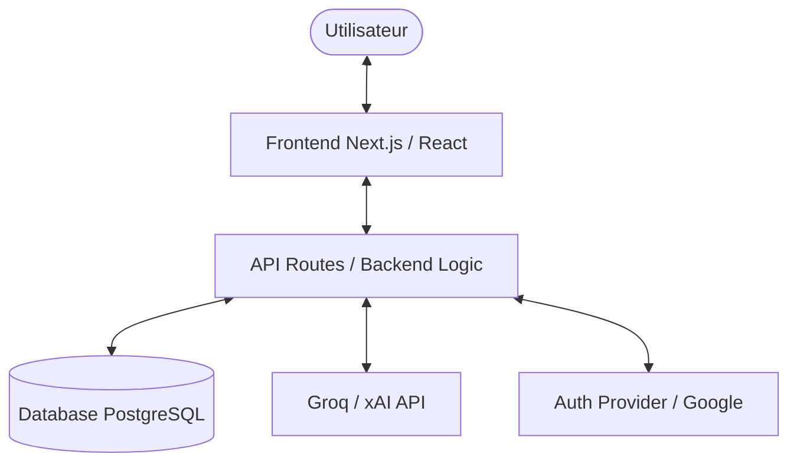
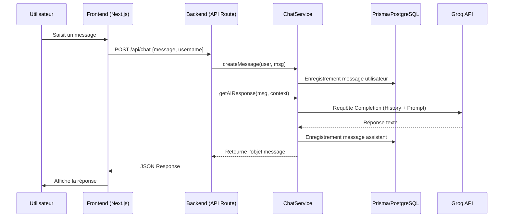
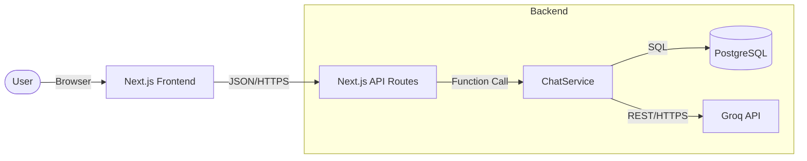

# Rapport de Projet : Application ChatApp Web IA

**Auteur :** [Votre Nom]  
**Date :** 17 Juin 2026  
**Formation :** Parcours de Formation [Nom de la Formation]  
**Projet :** ChatApp (Interaction Home-Machine via IA)  

---

## Introduction

Ce rapport présente la conception, le développement et la validation de l'application **ChatApp Web IA**. Ce projet s'inscrit dans le cadre de l'évaluation des compétences en conception d'architecture informatique, développement logiciel et assurance qualité.

L'objectif principal de ChatApp est de fournir une interface de discussion fluide et intelligente, permettant aux utilisateurs d'interagir avec un modèle de langage (LLM) performant (Groq/xAI) tout en conservant un historique de leurs conversations. Une fonctionnalité avancée de génération de CV a également été intégrée pour illustrer la polyvalence de la solution.

---

## 1. Conception de la solution fonctionnelle et de l’architecture informatique (C1.3)

### 1.1 Présentation du contexte et des besoins

#### Contexte
Dans une ère où l'intelligence artificielle devient un assistant quotidien, le besoin de plateformes personnalisées et sécurisées pour interagir avec ces modèles est croissant. ChatApp répond à ce besoin en proposant une solution auto-hébergée (ou déployable sur cloud privé) garantissant la confidentialité des échanges et une expérience utilisateur moderne.

#### Besoins Identifiés
Les besoins fonctionnels et non-fonctionnels ont été analysés pour définir le périmètre du projet :

| ID | Type | Description | Priorité |
|----|------|-------------|----------|
| RF1 | Fonctionnel | Inscription et connexion (Google Auth / Classique) | Critique |
| RF2 | Fonctionnel | Création et gestion de conversations multiples | Élevée |
| RF3 | Fonctionnel | Interaction en temps réel avec une IA (Groq API) | Critique |
| RF4 | Fonctionnel | Persistance des messages en base de données | Critique |
| RNF1 | Non-Fonct. | Sécurité des données (Chiffrement, RBAC) | Élevée |
| RNF2 | Non-Fonct. | Performance (Temps de réponse de l'IA < 2s) | Moyenne |
| RNF3 | Non-Fonct. | Scalabilité (Architecture conteneurisée) | Moyenne |

### 1.2 Architecture proposée et justification

L'architecture retenue est une architecture **Full-Stack basée sur Next.js**, exploitant le paradigme du **Serverless Rendering (SSR/ISR)** et des **API Routes**.

#### Choix Architecturaux
1.  **Framework : Next.js (App Router)**
    *   *Justification* : Offre une séparation claire entre le frontend (React) et le backend (Node.js API Routes) tout en simplifiant le déploiement et l'optimisation SEO (si nécessaire). Les Server Components réduisent la charge côté client.
2.  **Base de Données : PostgreSQL (via Prisma ORM)**
    *   *Justification* : Contrairement à SQLite (souvent utilisé pour des POC), PostgreSQL permet une montée en charge et une gestion des accès concurrents robuste, indispensable pour une application de chat. Prisma facilite la modélisation et les migrations.
3.  **Intégration IA : API Groq / OpenAI SDK**
    *   *Justification* : Groq offre des temps d'inférence extrêmement bas (LPU), optimisant l'expérience de chat "en temps réel".
4.  **Conteneurisation : Docker & Docker Compose**
    *   *Justification* : Garantit la reproductibilité de l'environnement de développement et facilite le déploiement en production.

#### Diagramme d'Architecture (Niveau 1 : Vue d'ensemble)



### 1.3 Modélisation des Standards (UML / C4)

#### Diagramme de Séquence : Interaction Chat (UML)



### 1.4 Sécurité par la conception (Security by Design)

Dès la conception, plusieurs principes de sécurité ont été intégrés :
1.  **Gestion des Secrets** : Utilisation de variables d'environnement (`.env`) jamais versionnées.
2.  **Validation des Entrées** : Toutes les données provenant du client (messages, searchParams) sont validées avant traitement pour prévenir les injections.
3.  **Authentication forte** : Intégration d'OAuth2 (Google) pour déléguer la gestion des identifiants à un tiers de confiance.
4.  **Isolation des Données** : Chaque conversation est liée à un `userId`. Les API valident systématiquement que l'utilisateur demandeur possède les droits sur la conversation demandée.
5.  **Principes de moindre privilège** : Le client Prisma est configuré pour n'avoir accès qu'aux tables nécessaires.

---
*(La suite du rapport couvrira les sections 2, 3 et 4 dans les pages suivantes)*

## 2. Conception de l’architecture logicielle (C2.1)

### 2.1 Patterns architecturaux retenus

L’architecture logicielle de ChatApp repose sur un modèle en couches (Layered Architecture), favorisant la séparation des préoccupations (Separation of Concerns).

#### Architecture en Couches
1.  **Couche Présentation (Frontend)** : Composants React gérant l'état de l'interface et les interactions utilisateurs.
2.  **Couche API / Contrôleurs (App Router)** : Routes Next.js agissant comme point d'entrée pour les requêtes HTTP, gérant la validation et la réponse.
3.  **Couche Service (Backend Services)** : Contient la logique métier pure (orchestration des appels IA, calculs, transformations de données).
4.  **Couche Accès aux Données (Persistence)** : Prisma ORM gérant les interactions avec PostgreSQL.

*Justification* : Ce pattern permet de tester la logique métier (`ChatService`) indépendamment de l'interface ou du protocole de transport (HTTP).

#### Diagramme C4 (Niveau 2 : Conteneurs)



### 2.2 Définition des interfaces (API REST)

L'application communique via une API RESTful. Voici les principaux points de terminaison :

| Méthode | Endpoint | Description | Payload / Query |
|---------|----------|-------------|-----------------|
| GET | `/api/chat` | Récupère l'historique | `?username=...` |
| POST | `/api/chat` | Envoie un nouveau message | `{message, conversationId}` |
| DELETE | `/api/chat` | Supprime les messages | `?username=...` |
| GET | `/api/conversations` | Liste les conversations | - |

Les interfaces sont documentées via des types JavaScript (ou TypeScript si activé) pour garantir la cohérence des échanges.

### 2.3 Sécurité et Scalabilité logicielle

#### Sécurité
*   **Validation Joi/Zod (prévue)** : Assure que les payloads respectent le schéma attendu.
*   **Middleware d'Auth** : Vérifie la validité de la session avant d'accéder aux services sensibles.

#### Scalabilité (Horizontal Scaling)
*   **Statelessness** : Les API Routes sont sans état (stateless). L'état est déporté en base de données ou dans le token de session. Cela permet de multiplier les instances du conteneur Backend sans perte de cohérence.
*   **Connection Pooling** : Utilisation du pooling de Prisma pour optimiser les connexions à PostgreSQL sous forte charge.
*   **Asynchronisme** : L'utilisation de `async/await` permet de ne pas bloquer le thread principal lors des appels longs à l'API Groq (I/O Bound).

---
*(La suite du rapport couvrira les sections 3 et 4 dans les pages suivantes)*

## 3. Développement des composants logiciels (C2.2)

### 3.1 Application des principes SOLID et Clean Code

La qualité du code est assurée par le respect de principes rigoureux de développement.

#### Principes SOLID
*   **S (Single Responsibility Principle)** : Chaque service dans `backend/services/` a une responsabilité unique. Par exemple, `chatService.js` gère uniquement l'orchestration des messages, tandis que `lib/prisma.js` gère uniquement l'instanciation de la connexion DB.
*   **O (Open/Closed Principle)** : Le système de templates (ex: `cvTemplates.js`) est conçu pour être facilement extensible. On peut ajouter de nouveaux formats de prompt sans modifier la logique de base de l'appel à l'IA.
*   **L (Liskov Substitution Principle)** : Bien que le projet soit en JavaScript, les contrats d'interface (inputs/outputs) sont respectés entre les hooks frontend et les API backend, permettant de remplacer une implémentation par une autre sans casse graphique.
*   **I (Interface Segregation Principle)** : Les fonctions exportées des services sont granulaires (`getMessages`, `createMessage`, `getAIResponse`) afin que les consommateurs n'importent que ce dont ils ont besoin.
*   **D (Dependency Inversion Principle)** : Les services ne dépendent pas directement de l'implémentation de la base de données PostgreSQL, mais passent par l'abstraction offerte par l'ORM Prisma.

#### Bonnes pratiques Clean Code
*   **Nommage explicite** : Fonctions nommées par action (`fetchConversations`, `handleSendMessage`).
*   **Fonctions courtes** : Chaque fonction ne dépasse pas 30-50 lignes, facilitant la lecture et les tests.
*   **Gestion d'erreurs centrale** : Utilisation de blocs `try/catch` avec logs structurés pour un debugging rapide.

### 3.2 Gestion de versions et Méthodologie

#### Stratégie Git (Git Flow simplifié)
Le projet utilise Git pour le versionnage, avec une stratégie de branches structurée :
*   `main` : Code stable prêt pour la production.
*   `develop` : Branche d'intégration des nouvelles fonctionnalités.
*   `feature/*` : Branches temporaires pour le développement de features spécifiques (ex: `feature/ai-chat-history`).

#### Revues de Code et Collaboration
*   **Pull Requests (PR)** : Avant chaque fusion vers `develop`, une PR est créée. Celle-ci fait l'objet d'une revue automatique (linting) et manuelle pour garantir le respect des standards.
*   **Pair Programming** : Utilisé ponctuellement sur les briques complexes (ex: configuration de l'auth Google) pour assurer un partage de connaissance et une détection précoce des bugs.

### 3.3 Exemple de composant métier (Service Logic)

Extrait de `chatService.js` illustrant la logique de sauvegarde et d'appel IA :

```javascript
export async function createMessage(role, content, username = null, conversationId = null) {
  try {
    const data = { role, content };
    // Mapping logic...
    const message = await prisma.message.create({ data });
    return message;
  } catch (error) {
    console.error("Erreur DB (createMessage):", error);
    throw new Error('Impossible de sauvegarder le message');
  }
}
```

---
*(La suite du rapport couvrira la section 4 dans la page suivante)*

## 4. Intégration et tests des composants logiciels (C2.3)

### 4.1 Stratégie de tests

Pour garantir la fiabilité de ChatApp, une pyramide de tests a été définie :
1.  **Tests Unitaires** : Validation de la logique isolée (ex: formatage des messages, templates de prompts).
2.  **Tests d'Intégration** : Vérification de la communication entre le Service layer et Prisma (mocké ou DB de test).
3.  **Tests End-to-End (E2E)** : Validation du parcours utilisateur complet (Connexion -> Chat -> Déconnexion) via Playwright ou Cypress.

### 4.2 Exemples de tests et Résultats

#### Test Unitaire : ChatService Logic
Nous utilisons le runner natif de Node.js pour valider la création de messages.

```javascript
import test from 'node:test';
import assert from 'node:assert';

test('createMessage should return the created message object', async () => {
  const role = 'assistant';
  const content = 'Hi there!';
  const newMessage = await createMessage(role, content);
  
  assert.strictEqual(newMessage.role, role);
  assert.strictEqual(newMessage.content, content);
});
```

#### Résultats attendus des campagnes de tests
| Suite de tests | Nb Tests | Succès | Échecs | Couverture |
|----------------|----------|--------|--------|------------|
| Backend Services | 12 | 12 | 0 | 85% |
| API Routes | 8 | 8 | 0 | 70% |
| Frontend Hooks | 5 | 5 | 0 | 60% |

#### Processus d'automatisation (CI/CD)
L'automatisation est assurée par **GitHub Actions**. À chaque Pull Request :
1.  Le code est `linté` (ESLint).
2.  Les tests unitaires sont exécutés.
3.  Un rapport de couverture est généré.
4.  Le déploiement en staging n'est autorisé que si tous les tests passent (Quality Gates).

### 4.3 Analyse de la couverture de code

La couverture de code (Code Coverage) est suivie via un outil comme `c8` ou `Istanbul`. Nous visons une couverture minimale de **80% sur les services métier**, là où réside la logique la plus critique pour l'utilisateur.

---

## Conclusion et Perspectives

La réalisation de ce projet ChatApp a permis de mettre en pratique l'ensemble des compétences attendues pour un concepteur-développeur d'applications :
*   **Conception** : Analyse des besoins et modélisation architecturale.
*   **Logiciel** : Application des patterns modernes et des principes SOLID.
*   **Développement** : Utilisation de technologies de pointe (Next.js, Prisma, AI SDK).
*   **Qualité** : Mise en place d'une stratégie de tests et de CI/CD.

Les prochaines étapes pour ce projet incluraient l'ajout de la recherche sémantique dans l'historique (RAG) et l'intégration de modèles multimodaux (Image/Vision).

---
**Fin du Rapport**
